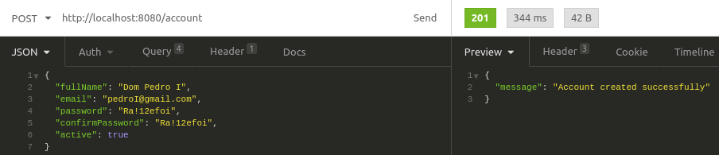
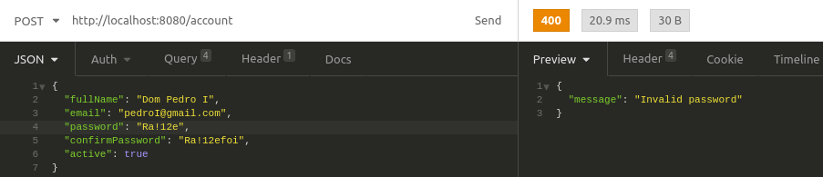

# Account Service App
- Aplicação responsável em receber dados de uma conta, validá-los e retornar mensagem de sucesso ou erro.

## Tecnologias utilizadas
    - Linguagem: Kotlin
    - Framework: Spring Boot
    - Gerenciador de dependências: Gradle
    - IDE utilizada: Intellij Community
    - Bibliotecas utilizadas:
        - Gson: Leitura e escrita de arquivos JSON
        - Junit: Execução de testes unitários e de integrações
        - Swagger: Documentação e testes de APIs

## Decisões técnicas e arquiteturais
    - A aplicação foi desenvolvida em Kotlin por ser produtiva, minimalista e compatível com o framework Spring, facilitando a criação de manipulação de APIs
    - Desenvolvimento inspirado em Clean Architecture (foco principal no domínio e nas suas regras de negócio, deixando o framework em segundo plano), com as seguintes camadas:
    - Domain: Core da aplicação com códigos de casos de uso e entidade referentes aos domínios da aplicação (Account).
    - API: Códigos de Controller (mapeamento de API), Request (Dados de entrada) e Response (Dados de saída).
    - Config: Camada responsável em tratar configurações como por exemplo Injeção de Dependências.

## Como utilizar a aplicação:
- Para compilar a aplicação:
    - Através do terminal, acessar a pasta raiz da aplicação e digitar o comando:
      #### ./gradlew build
    - Se a compilação for executada com sucesso, o arquivo executável da aplicação (account-service.jar) será gerado na pasta build/libs/account-service.jar

- Como executar a aplicação:
  - Através do terminal, acessar a pasta (build/libs) onde está o arquivo account-service.jar e executar o seguinte comando:
    #### java -jar account-service.jar

- Como utilizar a aplicação:
  - Opção 1: Swagger
    - Através do browser digite o endereço - http://localhost:8080/swagger-ui.html
  - Opção 2: API Client (Utilização do Postman ou Insomnia, por exemplo)

- Exemplo de utilização (Insomnia)

